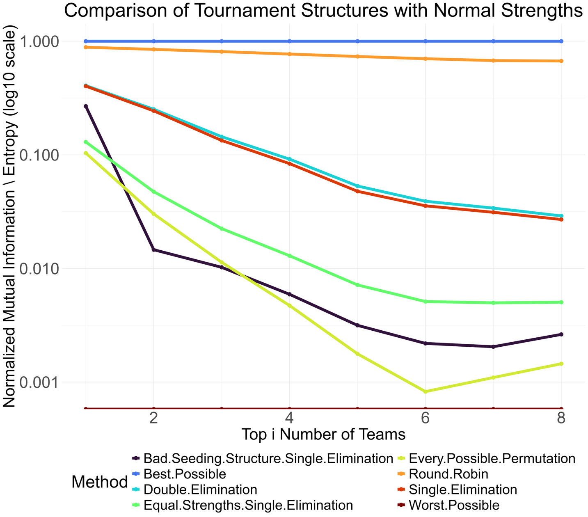

```{r setup, echo=FALSE, message=FALSE}
knitr::opts_chunk$set(
	echo = FALSE,
	fig.align = "center",
	message = FALSE,
	warning = FALSE
)

gjm <- function(x, color = "red") {
  sprintf("\\textcolor{%s}{%s}", color, x)}
```

```{r pkgs}
library(tidyverse)
library(dplyr)
library(stringr)
theme_set(theme_minimal())
```

# Introduction

<!-- @Rajski1961 -->
<!-- @McShane2019 -->
<!-- Csato 2020: The incentive (in)compatibility of group-based qualification systems. World cup qualifying has problems where teams are better off exerting lower effort -->

<!-- @Sziklai2022 -->


There are hundreds of different competitions structures that dictate how a set of teams compete against each other to determine an overall ranking.  Common structures include bracket tournaments where if a team wins their competition they advance to the next round.  Bracket tournaments can be run as single elimination where competitors advance or are eliminated based on a single match (e.g. NCAA College Basketball Tournament, National Football League (NFL) playoffs, major tennis tournaments) or where each round is contested as a best of $k$ series (e.g. $k$ = 7: National Basketball Association (NBA) playoffs, National Hockey League (NHL) playoffs, $k$ varies by round: Major League Baseball (MLB), Women's National Basketball Association (WNBA)) and the series winner advance while the series loser is eliminated.  Additional styles of the bracket tournaments include variations where competitors are not eliminated after a single loss such as double elimination tournaments where competitors continue until they have lost twice.  Within double elimination tournament, there are several variations.  For instance, the NCAA College Wrestling tournament is a double elimination tournament, however, if a competitor loses a match they fall into the consolation bracket and the best they can finish after a loss before the finals is 3rd place making this not a "true" double elimination format.  Olympic judo uses a variant of this system with single elimination until the quarterfinals followed by a consolation bracket consisting of the four quarterfinal losers who still have a chance for a bronze medal^[in Olympic judo they award two bronze medals to the two  competitors who each win their side of the consolation bracket]. 

"True" double elimination - a bracket tournament where a competitor can still finish ranked first as long as a competitor has not lost two games - is used in NCAA baseball and softball for certain rounds in their postseason.  Additional variants of double elimination include double elimination brackets with a "true third" match which includes an additional match contested between the competitors ranked 2nd (loser of the finals) and 3rd (winner of the consolation bracket) at the end of the tournament *if they have not already competed against each other*. There is also a variation of double elimination where only those competitors who have lost to a competitor that makes the finals are placed into the consolation bracket and given the chance to compete for third place.  This style of competition is used in Olympic wrestling (both freestyle and Greco-Roman)^[As in Olympic judo, Olympic wrestling also award two bronze medals to the winners of each side of the consolation bracket]. 

<!-- A paragraph about Swiss, Dutch, and Monrad systems -->

In bracket style competitions, only a handful of the match-ups that are possible actually occur.  When every possible competitive pairing occurs, this is referred to as a round-robin structure where every competitor plays every other competitor the same number of times.  Single round-robin, where was possible match-up occurs exactly once, is used in, for examples, the group stage of the FIFA World Cup to create a ranking to determine which teams advance to the next round.  Double round-robin, where each possible pairing occurs twice, is used in association football in English Premier League (EPL) and in chess during the FIDE candidates tournament (a tournament that decides who will challenge the world champion).  For the sake of brevity, we review only a small number of possible competition structures, but the interested reader can find a more complete list of competition structures in @Goosens2024, @Appleton1995-zn and @Csato2021.

A natural question of interest after reviewing different types of competition structures is: which competition structure is best?  As with most complicated questions, the answer is "it depends".  One commonsense conceptualization for the best competition structure is that the final rankings produced by a competition structure should closely match the true rankings of the strength of the competitors. That is, a good competition structure should rank the true best team first, the true second best team second, and so on, until finally ranking the true worst team last.  We refer to this property of a competition structure as the efficacy of the structure (@Lasek2018-de, @Sziklai2022-kf).  If one were only interested in correctly ranking the true best competitor as first, with the ranks of the remaining competitors viewed as inconsequential, we refer to this here are effectivity (@Glenn1960-mn).  While there are many competition structures where efficacy and effectivity are useful measures^[efficacy is a useful measure for the EPL, for example, as the ranking of the teams matters at both the high end (i.e. entry into special tournaments) and the low end (i.e. relegation status) and effectivity is a useful measure for the NCAA College Basketball tournament (i.e. main goal is to crown a champion)], there are many other competitions where the correct ranking of more than one competitor, but not all the competitors is of import.  For instance, in Olympic competition, the goal of a competition structure is to correctly rank the top 3 competitors to award gold, silver, and bronze medals to^[Some sports award two bronze medals (e.g. wrestling, judo, boxing, tae kwon do)]. In many American sports, for instance the NFL, the goal of the competition structure of the regular season is to rank the top 7 teams in each conference to choose the playoff teams with the ranking of the teams 8 through 16 in each conference inconsequential in determining a Super Bowl champion^[The ranking of teams outside of the playoffs does matter for draft purposes though].  We coin the term "salient ranks" to refer to the ranks of a competition structure that matter.  That is the ranks 1, 2, and 3 in Olympic competition are the salient ranks in that competition structure.  In this notation, efficacy is a measure with with salient ranks 1 through $n$ where $n$ is the number of competitors, and effectivity is a measure where 1 is the only salient rank.  
<!-- Efficacy: @Lasek2018-de, @Sziklai2022-kf -->
<!-- Effectivity: @Glenn1960-mn -->

<!-- From Goosens 2024: The ability of a tournament to rank contestants according to their true strength is called efficacy (Lasek and Gagolewski, -->
<!-- 2018; Sziklai et al., 2022). Efficacy with respect to only the best player is also known as effectivity (Glenn, 1960) -->
<!-- or predictive power (Ryvkin and Ortmann, 2008; Vu and Shoham, 2011). -->

If the only goal of a competition structure was high efficacy of the salient ranks, the best way to achieve this would be to play each pair of possible match ups of competitors as many times as possible.  Of course, this is impossible due to many factors including time constraints, cost constraints, and wear and tear on competitors in high impact sports (e.g. boxing, American football, etc.).  In addition, competitions where the true best team is guaranteed or nearly guaranteed to win may be less appealing to fans and may drive down demand as discussed in @Johnson2022-wz.  

In light of this, many different competition structures have been proposed, several of which are mentioned previously.  Given these many competition structures, ideally there would be a way comparing the performance of different competition structures to each other. 

Here, we propose a novel metric for evaluating different competition structures.  


<!-- @Marchand2002-tq only cares about the probability of winning in seeded vs random draw knockout tournemnts.   -->


<!-- @Johnson2022-wz: Match outcome uncertainty and the Rottenberg hypothesis -->


Different competition structures have unique strengths and weaknesses, affecting how well they reflect the true rankings of the teams. The goal of a tournament is to find the best teams, but how can we quantify how well a tournament performs? In some instances, the tournament organizers only award the overall winner, but other times, the top three or ten teams are awarded. Because of this, organizers may prefer one structure over another based on their needs. Tournament organizers must also take into account factors like cost, timeliness, entertainment value, and fairness when choosing a tournament structure.


To evaluate a tournament’s effectiveness, we propose a numerical metric
that quantifies how accurately it orders teams based on their true
rankings. Tournament results can be viewed as a "message" attempting to
convey the true team rankings. However, various factors introduce noise,
leading to information loss. We use principles from information theory
to measure this information loss across multiple tournament simulations
to assess the reliability of different formats.

# Methods

Consider a set of $n$ teams indexed from $i = 1, 2, \cdots, n$ each with
an associated true strength parameter
$\boldsymbol{\theta} = (\theta_1, \theta_2, \ldots, \theta_n)$ such that
$(\theta_1 > \theta_2 > \ldots > \theta_n)$. Next, let
$r(\boldsymbol{\theta})$ be the indexes of $\boldsymbol{\theta}$ when
theta is sorted from largest to smallest so that
$r(\boldsymbol{\theta}) = \{1, 2, \ldots, n-1, n\}$. Next define
$T(\phi, s)$ as a tournament with schedule $\phi$ and seeding structure
$s$. $\phi$ contains all the information about the scheduling of teams,
which could be fully known prior to the tournament (i.e. round robin) or
determined as the tournament progresses (i.e. single elimination
tournament). We then let $\hat{r}(T(\phi, s),\boldsymbol{\theta})$ be an
$n$- dimensional vector valued random variable that gives the results of
a tournament as a vector of the indexes of the vector
$\boldsymbol{\theta}$. The index in the first position of the vector
$\hat{r}(T(\phi, s),\boldsymbol{\theta})$ indicates the index of the
team that finished first, the index in the second position of the vector
$\hat{r}(T(\phi, s),\boldsymbol{\theta})$ indicates the index of the
team that finished second, and so on.

For example, in a 4 team tournament,
$\hat{r}(T(\phi, s),\boldsymbol{\theta})$ = (3, 2, 1, 4) indicates that
the team with index 3 (i.e. the true third best team) won the
tournament, the true second best team finished second, the true best
team finished third and the true 4th team finished 4th in that
particular tournament. If $\hat{r}(T(\phi, s),\boldsymbol{\theta})$ =
(1, 2, 3, 4), this means that the random outcome of the tournament was
the same as the true ordering of the teams.

If one views the true ranking of the teams in a tournament as a message
to be sent to a receiver and the outcome of the tournament as a message
that is received, we can measure the "goodness" of a tournament in terms
of its ability to accurately transmit the true ranking. We can then use
concepts from information theory to assess the ability of a tournament
to correctly rank teams. Specifically, we start with the concept of
mutual information (CITE). For two random variables $X$ and $Y$ mutual
information is defined as:

$$
I(X;Y)=\sum_{y\in Y}\sum_{x\in X}p(x,y)\log \frac {p(x,y)}{p(x)\,p(y)}
$$

In our setting, we replace $X$ and $Y$ with $r(\boldsymbol{\theta})$ and
$\hat{r}(T(\phi, s),\boldsymbol{\theta})$, and we could seek to estimate
$I(r(\boldsymbol{\theta}),\hat{r}(T(\phi, s),\boldsymbol{\theta}))$. For
simplicity, we drop the arguments from the functions $r$ and $\hat{r}$
for ease of exposition.

We note here that $r$ is not a random variable, however, since the
indexing of the teams in the vector $\boldsymbol{\theta}$ is arbitrary
(we use 1, 2, 3, etc. for convenience, but any indexing is valid), we
can view this a random variable where all permutation so of the $n$
teams are equally likely. Therefore when calculating the mutual
information in this setting, we set $p(r) = \frac{1}{n!}$. By a similar
argument we set $p(\hat{r}) = \frac{1}{n!}$.

We define the mutual information of $r$ and $\hat{r}$ to be:

$$
I(r,\hat{r})=\sum_{r}\sum_{\hat{r}}p(r,\hat{r})\log \frac {p(r,\hat{r})}{p(r)p(\hat{r})} = n!\sum_{\hat{r}}p(r,\hat{r})\log \frac {p(r,\hat{r})}{(\frac{1}{n!})^2}
$$

While there are $n!$ different permutations for the result of $r$, we
don't need to sum across these as any specific choice of $r$ is just an
arbitrary labeling of the true strength parameters vector
$\boldsymbol{\theta}$. So given $r$, the distribution of $\hat{r}$ is
the same up to the labeling. Therefore, we only need to consider a
single permutation of $r$, we compute the the quantity inside the
summation, and then multiple by $n!$ (effectively summing across $r$).

In order to compute this quantity, we need to compute $p(r,\hat{r})$.
This probability is found by calculating the probability of a given
permutation of $\hat{r}$ and $r$ is assumed to be the permutation from
$\{1, 2, \ldots, n\}$. We estimate $p(r,\hat{r})$ empirically through
simulation.

However, using mutual information in this form does not suit our needs
in this setting. The problem is that mutual information in this form
will yield high values of mutual information when the output from the
tournament $\hat{r}$ is highly consistent *even if the ranking from the
tournament is incorrect*. As an example, if $n=4$ and the true order of
$\boldsymbol{\theta}$ is $r = \{1, 2, 3, 4\}$ and
$p(\hat{r} = \{4, 3, 2, 1\}) = 1$ will be the same mutual information as
when $r = \{1, 2, 3, 4\}$ and $p(\hat{r} = \{1, 2, 3, 4\}) = 1$ and in
both of these cases the mutual information will be maximized at:

$$
I(r,\hat{r})= n!\sum_{\hat{r}}p(r,\hat{r})\log \frac {p(r,\hat{r})}{\left(\frac{1}{n!}\right)^2} = n! log((n!)^2)
$$ and for the specific case when $n=4$ would be: $$
4! log_2(4!^2) = 24*log_2(24^2) = 220.0782
$$

In order to alleviate this problem, we instead consider *weighted*
mutual information. We want to give more weight to permutations from
$\hat{r}$ that are "closer" to $r$. There are any number of reasonable
choices for this weighting function, and we choose to use squared error.
Specifically,

$$
w(r, \hat{r}) =
\begin{cases}
\frac{1}{\hat{r}'r}, & r \ne \hat{r} \\
1, & r = \hat{r}
\end{cases}
$$

In general, though any loss function $l(r, \hat{r})$ can be used:

$$
w(r, \hat{r}) =
\begin{cases}
\frac{1}{l(r, \hat{r})}, & r \ne \hat{r} \\
1, & r = \hat{r}
\end{cases}
$$

Note that one is 1/N!

And this does work because consistently getting the order incorrect is
perfect information.

However, because the number of teams that need to be accurately ordered
differs based on the tournament organizers, a second weighting function
was found to portray the importance, or remarkability, of each value in
$\hat{r}$. We call these "remarkable weights" ($m(r)$) to differentiate
from the other weighting function. "Remarkable weights" are set to allow
for a subjective belief of what determines a good tournament. For a
four-team tournament, if the user decides that only the winner is
important, then $m(r) = \{1,0,0,0\}$. However, if the organizers want an
accurate leaderboard with the winner as the most important, then a
potential $m(r)$ could be $\{3,1,1,0\}$. With the addition of the
weighting functions, the formula for mutual information is updated:

$$
I(X;Y)=\sum_{r}\sum_{\hat{r}} w(r,\hat{r}) * m(r) * p(r,\hat{r})\log \frac {p(r,\hat{r})}{p(r)p(\hat{r})}
$$

Because this mutual information is unitless, the formula can be
standardized to be between 0 and 1 using the complement of Rajski's
distance: $$
1 - (1 - \frac{I(X,Y)}{\text{max\{}H(X), H(Y)\}})
$$

where $H(X,Y)$ is entropy given by:

$$
max\{H(X), H(Y)\} = \sum_{r}  p(r) \log p(r) = n! \log n!
$$

The complement is taken so that the more accurate tournaments are closer
to 1 and the less accurate are closer to 0.

<!-- # ryan way  -->

<!-- Consider a set of $n$ teams indexed from $i = 1, 2, \cdots, n$ each with an associated true strength parameter $\boldsymbol{\theta} = (\theta_1, \theta_2, \ldots, \theta_n)$ such that $(\theta_1 < \theta_2 < \ldots < \theta_n)$.  Next, let $r(\boldsymbol{\theta})$ be the rank of the vector $\boldsymbol{\theta}$ from largest to smallest so that $r(\boldsymbol{\theta}) = \{n, n-1, \ldots, 2, 1\}$.  Next define $T(\phi, s)$ as a tournament with schedule $\phi$ and seeding structure $s$.  $\phi$ contains all the information about the scheduling of teams, which could be fully known prior to the tournament (i.e. round robin) or determined as the tournament progresses (i.e. single elimination tournament).  We then let  $\hat{r}(T(\phi, s),\boldsymbol{\theta})$ be a vector valued random variable that gives the results of a tournament as a vector of ranks.   -->

<!-- Figure out what $\hat{r}$ should look like.   -->

<!-- Let $\boldsymbol{x} = (x_1, x_2, \ldots, x_n)$ be the permutation of indexes of $\boldsymbol{\theta}$ such that $x_1 = {i | \theta_i = max(\boldsymbol{\theta})}$ -->

# Results

In order to fairly compare tournament structures, we assume the true
strengths of the teams follow a normal distribution, where each team is
assigned an equally spaced quantile and each team's strength is the
z-score of its respective quantile. Using this assumption, 10,000
simulations, all with 8 total teams, were ran for a single game round
robin (each team plays each other once), a single elimination structure
with the usual seeding structure (1 vs 8, 4 vs 5, 3 vs 6, 2 vs 7), a
single elimination structure with a poor seeding structure (1 vs 2, 3 vs
4, 5 vs 6, 7 vs 8). For a better understanding of the results, the best
possible results (every structure has the best in rank 1, the 2nd best
in rank 2, etc), the worst possible results (every structure has the
worst in rank 1, the 2nd worst in rank 2, etc), every possible
permutation of the ranks once, and a single elimination tournament with
the usual seeding structure where every team is of equal strengths.
Because the metric found is unitless, we were able to normalize the
values using the best and worst results to make the range from 0 to 1,
with 0 as the worst and 1 as the best. After normalizing, we get the
following graph (note the y-axis is on a log10 scale):

{width="408"}

Figure 1 \ref{fig:fig1}

Based on the graph, the intuitive best tournament, round robin, does
show to be the best. Double elimination is slightly better than single
elimination, with the gap growing wider as the top number of teams
looked at increases. However, those are under the assumption that the
true strengths were ordered correctly in the seeding. If there is a poor
seeding structure, as seen in the graph, it can drastically impact the
effectiveness of the tournament. In the extreme case seen, the
tournament can actually become worse than deciding games by random
chance (like flipping a coin). Another important discovery is that the
single elimination structure with equal strengths is better than every
possible permutation. The line for every possible permutation would
likely be similar to a round robin structure with all equal strengths,
so perhaps the closer the teams are in true strength, the closer round
robin and single elimination become.

# Conclusion {#sec:conclusion}

This study introduced a weighted mutual information framework to
evaluate the effectiveness of different tournament formats in preserving
the true underlying rankings of teams. By simulating tournaments with
varying seeding structures and applying an information-theoretic
approach, we quantified how accurately each format conveys ranking
information. Our findings confirm the intuitive advantage of round robin
tournaments, which consistently outperformed single and double
elimination formats in ranking accuracy. Additionally, we observed that
seeding plays a critical role: poor seeding structures can significantly
degrade performance, in some cases making outcomes less informative than
random chance.

These results underscore the trade-off between tournament accuracy and
practical constraints such as time, cost, and entertainment value. While
round robin offers the highest fidelity to true rankings, it is often
impractical for large tournaments, highlighting the need for hybrid or
adaptive structures that balance accuracy with logistical feasibility.

Future work should extend this analysis to scenarios with more
tournament structures, more teams, incorporate probabilistic strength
models reflecting real-world uncertainty, and explore alternative
weighting schemes for different competitive priorities (e.g., top-4
accuracy versus full ranking). Applying these methods to actual
tournament data could further validate their usefulness for organizers
aiming to design fair and informative competitions.

# Acknowledgements {.unnumbered}

We thank the Department of Mathematics and Statistics at Loyola
University Chicago for their support and resources in conducting this study. We thank Kailey Marie Lum for the suggestion of the term "salient ranks". No external funding was received for this research.

# Supplementary Material {.unnumbered}

All supplementary material available at
<https://github.com/gjm112/tournaments>.

# References

